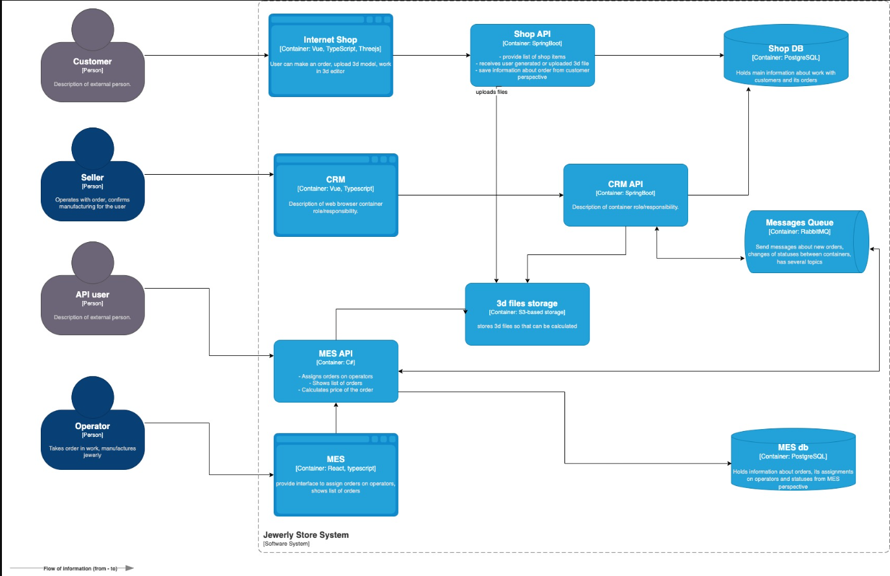

**Анализ** 

- Internet Shop → Shop API
- CRM → CRM API → MQ
- CRM API ↔ RMQ ↔ MES API
- MES API ↔ RMQ 

**Мотивация** 

- Диагностика проблем в распределённых системах. Быстрая локализация проблемных участков. Меньше времени на разрешение инцидентов - меньше недовольных клиентов, выше прибыль и репутация. Меньше спецы сжигают времени, а соответственно денег. 
- Упрощение отладки и тестирования, наглядность процессов. Меньше спецы сжигают  времени, а соответственно денег. 
- Повышение скорости отладки. Вместо сбора логов с разных сервисов — одна цепочка событий в Grafana.
- End-to-end видимость.
- Снижение потерь из-за ошибок. Пропущенные заказы, а это  прямые финансовые и репутационные потери.
- Поддержка SLA и аудит. Возможность демонстрировать стабильность и надёжность системы для внешних клиентов.

**Предлагаемое решение**

Компоненты, которые следует добавить на схему:

- OpenTelemetry SDK в каждый бэкенд сервис.
- OTEL Collector будет консолидировать все трассировки.
- Jaeger + ElasticSearch для хранения и визуализации трассировок.

[c4.drawio](c4.drawio)

**Компромиссы**

В каких случаях трейсинг не принесёт пользы или пока невозможен, или его реализация обойдётся слишком дорого.

- Само по себе требуется работы нескольких спецов или одного, но долго, если они будут заниматься внедрением тресингом при наличии куда более тяж. проблем по части бизнес велью, то это будет неоправданно. 

- В данном примере в первую очередь нужно решать проблему производительности. Первый набег можно выявления ботлнеков можно сделать и другими путями вроде покрытия логами, тестирования нагрузки в тестовой среде и тд. Когда пожар потушен, смотреть на внедрение трессинга. 

- Есть ли возможно докупить вычислительные мощности на обслуживание доп. компонентов трассировки.  
- Экспертиза спецов. Есть ли среди них тот кто первый на бетонный завод? Если нет, то, вероятно, нужно сначала дообучить или нанять внешнею экспертизу. Есть ли для этого бюджет...
- Сервис не критичен или не участвует в ключевых точках флоу заказа. 

**Аспекты безопасности**

- Технология единого входа пользователей. Служебные учетки для сервисов. Разграничить доступ к трейсам. Модель безопасности на основе разрешений (кто может видеть трейсы и от каких компонентов).
- Настроить корпоративный VPN.
- Исключить попадание чувствительных данных в трейсы.
- Хранить секреты от Jaeger, да и в целом всех компонентов в защищенном хранилище. 

**план внедрения трассирования**

OpenTelemetry — это универсальный, opensource инструментарий для мониторинга и диагностики программных систем, который объединяет разные виды данных в единую стандартную платформу.

Почему был сделан выбор в пользу OpenTelemetry: 

1. Объединение нескольких видов телеметрии
   OpenTelemetry поддерживает сбор метрик, трассировок и логов в единой платформе, что упрощает интеграцию и управление данными.
2. Стандартизация и совместимость
   Это открытая инициатива, поддерживаемая крупными компаниями (Google, Microsoft, Amazon и др.), которая обеспечивает стандартизацию форматов данных и протоколов, что облегчает интеграцию с различными системами.
3. Многоязычная поддержка
   OpenTelemetry предоставляет SDK для множества языков программирования (Java, Python, Go, JavaScript, C++, Ruby и др.), что делает его универсальным инструментом для различных технологий.
4. Интеграция с экосистемой
   Он легко интегрируется с популярными системами хранения и визуализации данных (Prometheus, Grafana, Jaeger, Zipkin), а также с облачными платформами.
5. Расширяемость и модульность
   Архитектура OpenTelemetry позволяет добавлять новые экспортеры, процессоры и инструменты без значительных изменений в существующем коде.
6. Активное сообщество и развитие
   Проект активно развивается сообществом разработчиков и компаний-участников, что обеспечивает быстрый отклик на новые требования рынка и исправление ошибок.
7. Поддержка автоматического сбора данных
   Многие SDK позволяют автоматически собирать телеметрию без необходимости писать много кода вручную.

1. Подключение OpenTelemetry экспортеров в сервисах системы (помечены как OpenTelemetry SDK на диаграмме c4) 
2. Развертывание в инфраструктуре OpenTelemetry Collector и Jaeger. 
3. Настройка в сревисах экспорта данных трассировки в Collector. Настройка Collector выгрузки данных для хранения в Jaeger. 
4. Тест и наладка. Просмотр собранных данных в Jaeger UI
